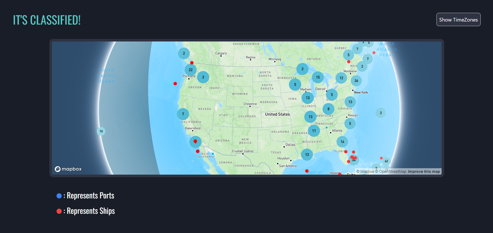

# Ocean's Eye

Deployment link - https://oceaneye-beta.vercel.app/

Ocean's Eye is a cutting-edge mapping tool designed for military and intelligence operations, built on the powerful Mapbox platform. It provides real-time visualization of global time zones, enabling users to monitor critical regions across the world with precision timing.

---
## Requirements

For development, you will only need Node.js and a node global package, npm, installed in your environement.

### Node
- #### Node installation on Windows

  Just go on [official Node.js website](https://nodejs.org/) and download the installer.
Also, be sure to have `git` available in your PATH, `npm` might need it (You can find git [here](https://git-scm.com/)).

- #### Node installation on Ubuntu

  You can install nodejs and npm easily with apt install, just run the following commands.

      $ sudo apt install nodejs
      $ sudo apt install npm

- #### Other Operating Systems
  You can find more information about the installation on the [official Node.js website](https://nodejs.org/) and the [official NPM website](https://npmjs.org/).

If the installation was successful, you should be able to run the following command.

    $ node --version
    v20.10.0

    $ npm --version
    10.2.5

If you need to update `npm`, you can make it using `npm`! Cool right? After running the following command, just open again the command line and be happy.

    $ npm install npm -g

###

## Install

    $ git clone https://github.com/harshjawla/oceaneye
    $ cd PROJECT_TITLE
    $ npm install

## Configure app

Open `a/nice/path/to/a.file` then edit it with your settings. You will need:

- A mapbox access token, generate one on [official MapBox website](https://www.mapbox.com/)
- After successfull generation of token, create a .env file in the root directory and add `REACT_APP_MAPBOX_API= your-access-token`

## Running the project

    $ npm start

## Simple build for production

    $ npm build

## Screenshots

